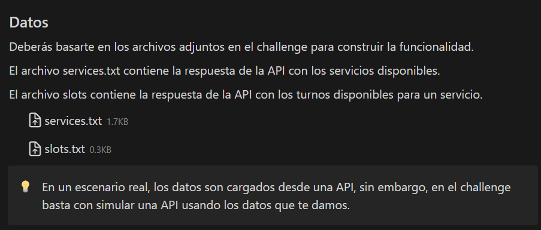
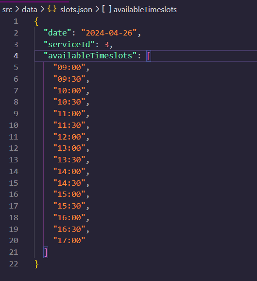

# Planify Challenge - Semelman Matias

## Posibilidad de mejora del challenge

Más allá de ser un challenge y de que estoy construyendo esta solución basado en los datos que se nos dan, propondria para hacerlo más real que el json de slots:

estuviese separado en un array de fechas, con sus respectivos horarios. De esta forma, se podría mockear pero mucho mas fiel a lo que seria una respuesta real de la API.
